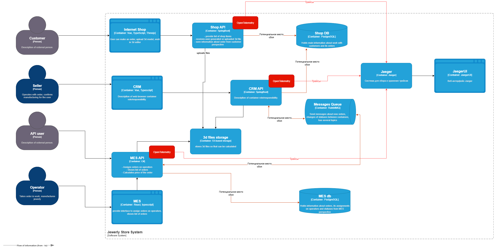

# Трейсинг

## Мотивация
Для проведения расследований различных инцидентов, возникающих при работе системы, компании необходим инструмент, позволяющий получить информацию о выполнении операций в распределенной среде. 
Данный инструмент позволит быстрее анализировать проблемные места и выявлять потенциальные уязвимости.
Это позволит компании:
1. Лучше понимать маршрут движений заказа между различными компонентами системы
2. Анализ узких мест в системе, влияющих на производительность
3. Анализ инцидентов происходящих в информационной системе

## Предлагаемое решение

Для внедрения трассировок в проект предлагается установить следующее ПО:
1. Jaeger - система для сбора, хранения и визуализации метрик
2. OpenTelemetry - набор библиотек для формирования трейсов и их отправки в систему сбора

### Этапы внедрения

| Компонент | Описание изменений                                                               |
|-----------|----------------------------------------------------------------------------------|
| Jaeger    | Установка и настройка компонентов Jaeger. Устанавливается «all-in-one» решение   | 
| ShopAPI   | Установка и настройка Open Telemetry SDK. Настройка формирования трейсов в коде  | 
| CRM API   | Установка и настройка Open Telemetry SDK. Настройка формирования трейсов в коде  | 
| MES API   | Установка и настройка Open Telemetry SDK. Настройка формирования трейсов в коде  | 

## Компромиссы
 
Внедрение трейсинга может иметь негативные последствия в некоторых ситуациях. В связи этим следует вдумчиво анализировать ситуации, в которых следует внедрять трассировки.
Среди негативных сценариев внедрения трейсинга можно выделить:
1. Внедрение трейсинга в высоконагруженных приложениях может увеличить нагрузку, т.к сбор и отправка трейсов дают определенный оверхед.
2. Внедрение трейсинга в системы с закрытым или legacy кодом затруднительно, т.к требует доработки исходного кода
3. Внедрение трейсинга требует определенных компетенций и может вызвать определенные трудности
4. Трейсы могут содержать чувствительную информацию и ее сбор и публикация не всегда корректны

## Безопасность при работе с системой трейсинга

Для предотвращения несанкционированного доступа к данным системы трейсинга следует предусмотреть следующие моменты:
1. Обеспечить авторизацию при доступе к компонентам трейсинга.
2. Обеспечить настройку прав доступа в соответствии с ролевой моделью. Доступ к определенным разделам информации и возможность выполнения определенных действий настраивается в соответствии с группами доступа.
3. Доступ к технической инфраструктуре доставки и хранения трейсов должен быть защищен

### Доп. Как будет реализованы автоматический мониторинг процесса прохождения заказа, полученные из данных трейсинга, и алертинг.
