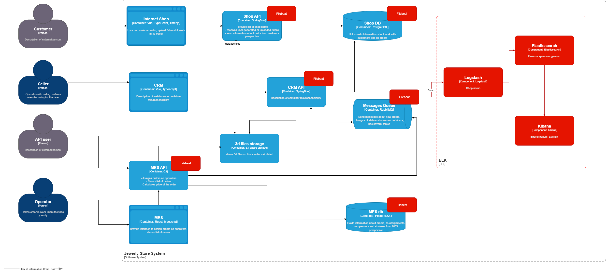

# Логирование
## Список необходимых логов с уровнем INFO

| Событие                                     | Описание логов                                                                                                                                                                                 | Уровни логирования                                                                                                                     |
|---------------------------------------------|------------------------------------------------------------------------------------------------------------------------------------------------------------------------------------------------|----------------------------------------------------------------------------------------------------------------------------------------|
| События создания заказа                     | Логируются события создания, изменения, отмены заказов. В логи попадают ключевые данные, по которым можно идентифицировать заказ и отследить его изменения.                                    | INFO\WARN\ERROR - это ключевая функциональность, детализация логирования должна быть максимально подробной                             |
| События изменения статуса заказа            | Логируются события изменения статуса заказов в различных системах. В логи попадают статус, время и обстоятельства(кто, как и где) изменения заказа.                                            | INFO\WARN\ERROR - это ключевая функциональность, детализация логирования должна быть максимально подробной                             |
| События расчета цен                         | Логируются события расчета стоимости изделий. В логи попадают статус расчета, время выполнения, сопроводительная информация (для идентификации и анализа)                                      | INFO\WARN\ERROR - WARN в случае выполнение операций дольше ожидаемого. ERROR - в случае ошибок при расчетах                            |
| События загрузки файлов в хранилище         | Логируются события загрузки файлов в хранилище. В логи попадают статус загрузки, данные файла, сопроводительная информация (для идентификации и анализа)                                       | INFO                                                                                                                                   |
| События взаимодействия с очередью сообщений | Логируются события отправки и получения сообщений в/из очередь сообщений. В логи попадают тип операции(отправка/получение), очередь, сопроводительная информация (для идентификации и анализа) | INFO\WARN\ERROR - отслеживание выполнения асинхронных операций является важным для анализа работы системы                              |
| Запросы к API                               | Логируются запросы к API. В логи попадают url, тип запроса, статус, сопроводительная информация (для идентификации и анализа)                                                                  | INFO\WARN\ERROR - отслеживание выполнения обращений к API является важным для анализа работы системы                                   |
| События действий пользователей и операторов | Логируются ключевые операции выполняемые пользователями и операторами. В логи попадают данные о пользователе и выполняемой им операции.                                                        | INFO\WARN\ERROR - логирование операций позволит отслеживать критические участки при работе пользователей в системе и выявлять аномалии |

## Мотивация
Внедрение системы логирования позволяет хранить и анализировать информацию, о происходящих в системе событиях
Это позволит компании:
1. Отслеживать историю выполнения операций в системе. Это повысит информированность сотрудников о событиях, происходящий в ключевых процессах компании и увеличит прозрачность действий.
2. Получать оперативную информацию о возникающих в системе ошибках, что позволит повысить качество системы и улучшить уровень поддержки.
3. На основании системы логирования можно построить систему журналирование действий сотрудников компании, что позволит лучше анализировать бизнес-процессы в компании и повысит эффективность работников.
4. Логи позволят анализировать технические данные по времени выполнения определенных заданий, что позволит улучшить эффективность процессов производства.

### Ключевые метрики

- Скорость поиска ошибок и их причин
- Повышение информированности о события в системе
- Повышение кол-ва выполненных заказов
- Повышение удобства работы сотрудников

### Порядок внедрения логирования и трейсинга

Наиболее критические участки для внедрения логирования это участки, которые участвуют в обработке заказов:
1. MES API - участвует в производственных процессах, работает с чувствительной для заказа информацией, такой как стоимость и статусы. Отслеживание работы в данной системе поможет значительно повысить информированность о выполнении процессов компании. 
2. СRM API - участвует в процессах обработки заказов в компании. Логирование в данной системе позволит улучшить сервис и повысит информированность клиентов.
3. Shop API - участвует в процессах работы пользователей. Логирование позволит улучшить качество работы с пользователями и повысить конверсию

## Предлагаемое решение

### Используемые технологии и их настройки

В качестве решения для системы логирования предлагается внедрение ELK стека. Для работы системы логирования требуется установка следующего ПО:
1. Elasticsearch
- Установить и настроить поисковый движок ElasticSearch
- Создать и настроить права доступа
- Создать необходимые индексы под разные данные
2. Logstash
- Установить и настроить logstash
- Настроить обработчики для обогащения поступающих логов служебными данными(сервис, сервер и т.п)
3. Kibana
- Установить и настроить Kibana
- Создать и настроить права доступа
- Настроить дашборды и фильтры для вывода логов
4. Filebeat
- Установить Filebeat на серверах, с которых необходим сбор логов
- Настроить отправку логов в ELK в 
5. Использование специальных библиотек для написания и отправки логов
- Добавить логирование в код компонентов

### Политика безопасности

В логах может содержаться чувствительная информация, содержащая техническую, персональную или комерческую информацию. Доступ к системе логирования должен быть ограничен. 
Для выполнения федеральных законов персональную информацию лучше не хранить в системе логирования, чтобы избежать ее утечки.
В связи с этим предлагается: 
1. Настроить шифрование при передаче данных  
2. Ограничить доступ к системе логирования. Проработать ролевой доступ и парольную политику.
3. Не логировать или удалять перед сохранением чувствительные данные
4. Настроить ротацию логов для удаления устаревших данных

### Политика хранения логов

Предлагается создать несколько индексов для хранения различных типов логов:
- Информация по заказу. Срок хранения 1 год
- Информация о запросах к API. Срок хранения 1 неделя.
- Информация о событиях в системе. Срок хранения 1 месяц
- Действия пользователей и операторов в системе. Срок хранения 1 месяц

## Система анализа логов

Алертинг позволит оперативно реагировать на внештатные ситуации. Предлагается настроить оповещение сотрудников компании через механизмы kibana основанные на правилах и статистических данных.
Алертинг можно настроить на следующие триггеры:
1. Резкий рост кол-ва ошибок, зафиксированных в логах
2. Ошибки при работе заказа, которые блокируют его выполнение
3. Появление оповещений системы безопасности

Для поиска аномалий, необходимо анализировать исторические данные, накопленные в системе. На их основе, при помощи машинного обучения автоматически выявлять аномальные сценарии происходящие в системе и при их подтверждении выдавать оповещение.
К таким сценариям можно отнести:
1. Рост или отсутствие заказов за определенный промежуток времени
2. Резкий рост выполнения определенных операций. Например изменение заказа
3. Изменение скорости выполнения процессов
4. Появление необычных данных при работе системы. Например, резкое увеличение или уменьшение рассчитываемой средней цены на товары может говорить об ошибках в алгоритмах расчета цены в MES.