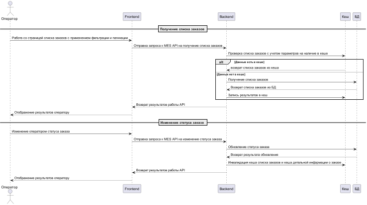

# Кеширование

## Мотивация

В системе наблюдаются проблемы с производительностью, которая выражается в низкой скорости работы со страницей заказов и скорость выполнения заказов.
Это влияет на качество обслуживания клиентов и пользовательский опыт. 
Внедрение кеширования позволит снизить нагрузку на БД и увеличить общую скорость загрузки страниц и получения данных.

Кеширование в первую очередь необходимо внедрить для компонентов:
1. MES API - кеширование операций требующих получения данных из БД.
2. CRM и Shop API - кеширование ответов на запросы партнеров и клиентов

## Предлагаемое решение

Клиентское кеширование не актуально для решения существующих в системе проблем (скорость выполнения запросов к API, скорость загрузки страниц). 
Предлагается внедрение серверного кеширования для компонентов системы. 
Серверное кеширование позволит снизить нагрузку на БД и ускорить получение наиболее часто запрашиваемых данных. 

Для кеширования в разных компонентах следует использовать следующие паттерны:
1. Кеширование запросов на получение списка заказов в MES API

Для МЕS наблюдаются проблемы с получением списка заказов на первой странице. Для данной страницы присутствует функциональность фильтрации и пагинации заказов. 
Для того чтобы реализовать кеширование данного функционала в MES API следует внедрить паттерн Cache-Aside, он позволит кешировать наиболее часто запрашиваемые данные с учетом фильтра, сортировки и пагинации.
Внедрение Cache-Aside выгодно по следующим причинам:
- Запросов на чтение больше чем запросов на изменение
- Устойчивость к сбоям системы кеширования. Если кеш будет не доступен, система продолжит работу
- Можно кешировать ответы на запросы целиком, не опираясь на структуру БД

В итоге Cache-Aside позволит снизить нагрузку на БД и ускорить отдачу для наиболее часто запрашиваемых списков заказов, что улучшит работу операторов и системы в целом

Сравнение с другими стратегиями кеширования:
- Write-Through: не подойдет, тк происходит работа с агрегированными данными с фильтрацией и пагинацией. Операций изменения в MES не слишком много
- Refresh-Ahead: не подойдет, тк происходит работа с агрегированными данными с фильтрацией и пагинацией.

2. Кеширование запросов от партнеров и клиентов к CRM и Shop API

При увеличении числа партнеров и пользователей сайта возникает проблема связанная с перегрузкой системы.
Партнеры и пользователи осуществляют как операции чтения, так и записи. 

В связи с этим предлагается несколько стратегий кеширования: 
- Для операций получения информации о заказах применить Refresh-Ahead. Это позволит точечно обновлять данные в кеше при поступлении изменений. При поступлении изменений по заказу из очереди сообщений можно сразу же обновлять кэш
- Для операций создания заказа предлагается использовать стратегию Write-Through, что позволит сразу создать и обновлять заказ в кеше и в дальнейшем обновлять его через Refresh-Ahead.

Сравнение с другими стратегиями кеширования:
- Cache-Aside: не подойдет, тк происходит много операций по записи в БД

### Стратегия инвалидации кеша

| Временная инвалидация                                                                             | Инвалидация, основанная на запросах                                       | Инвалидация, основанная на изменениях                                                                                     | Программная инвалидация                     | Инвалидация по ключу                                |
|---------------------------------------------------------------------------------------------------|---------------------------------------------------------------------------|---------------------------------------------------------------------------------------------------------------------------|---------------------------------------------|-----------------------------------------------------|
| Автоматически очищает старые данные. Подходит для данных, не требующих обязательной актуальности. | Обеспечивает актуальность данных, основанную на активности пользователей. | Подходит для обновления данных при запросах на создание и изменение. Можно использовать при создании и изменении заказов. | Позволяет настроить логику инвалидации кеша | Позволяет инвалидировать кеш по определенному ключу |

Для поддержания кеша в актуальном состоянии следует использовать несколько стратегий инвалидации кеша:
- Инвалидация на основе изменений: используется при создании и изменении данных заказа пользователями. Используется при создании или отмене заказа
- Инвалидация по ключу: используется при изменении конкретного заказа в системе. Используется для сброса кеша при обновлении данных заказа на основании изменений в системе, в том числе асинхронных.
- Инвалидация кеша по времени (TTL): используется для инвалидации устаревших данных. Используется для автоматического удаления кеша по истечении определенного периода времени 

